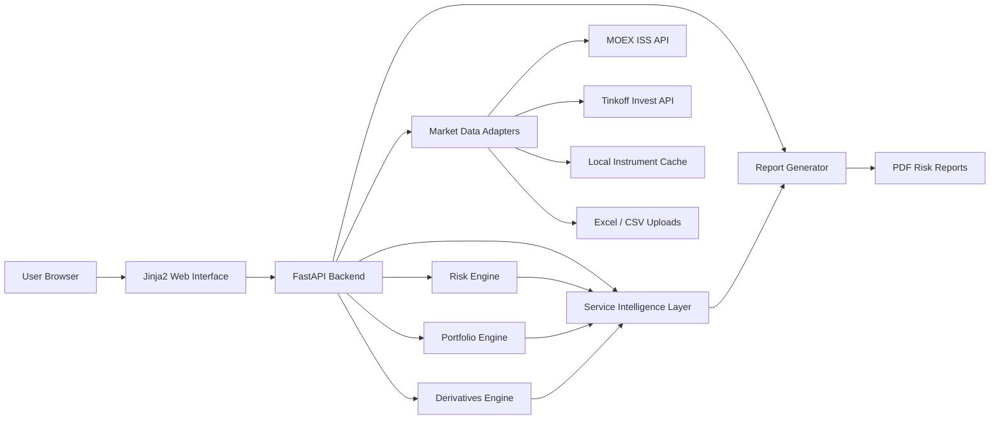

# Financial Risk Analytics Platform

A modular web application for market risk analysis, portfolio analytics, derivatives pricing, stress testing, model validation, and PDF reporting. The platform was developed as a coursework software team project focused on transparent risk estimation workflows for SPFI MOEX oriented instruments and related financial products.

The application combines a FastAPI backend, a Jinja2/Bootstrap/Plotly web interface, Python quantitative finance modules, MOEX ISS data access, Tinkoff Invest data access, Excel/CSV import, and Docker based deployment.

> This project is an educational and analytical prototype. It is not financial advice and should not be used as a production trading or regulatory risk engine without additional validation, monitoring, access control, and data governance.

## What the platform does

- Calculates single asset market risk from Tinkoff data, manual price series, or generated demo data.
- Computes historical VaR, parametric VaR, Expected Shortfall, liquidity adjusted VaR, and PnL series.
- Builds portfolio level risk metrics using covariance based aggregation and efficient frontier simulation.
- Loads instruments, historical candles, and option boards from MOEX ISS.
- Searches Tinkoff instruments through a shared local cache with optional live API fallback.
- Prices options with the Black-Scholes model and Greeks.
- Estimates option risk with Delta-Normal, Delta-Gamma, Monte Carlo, and optional full revaluation.
- Supports futures/SPFI style linear pricing and linear derivative VaR.
- Provides bond and swap valuation logic with cashflow, curve, scenario, and hedge ratio analysis.
- Runs stress scenarios, rolling VaR/ES backtesting, and factor based risk attribution.
- Generates interpretation blocks, Risk Copilot summaries, hedge ideas, charts, and downloadable PDF reports.
- Runs locally or in a containerized deployment environment such as Render.

## Core modules

| Area | Implementation | Purpose |
| --- | --- | --- |
| Web interface | `templates/index.html` | Single page workspace with Basic and Pro modes, forms, charts, tabs, and report actions |
| API orchestration | `main.py` | FastAPI routes, request validation, workflow coordination, and report endpoints |
| Risk metrics | `services/risk_calculator.py` | PnL, historical VaR, Expected Shortfall, parametric VaR, LVaR |
| Portfolio analytics | `services/portfolio_manager.py` | Portfolio VaR, covariance aggregation, efficient frontier |
| Market data | `services/moex_service.py`, `services/tinkoff_service.py` | MOEX ISS access, Tinkoff search, candle loading, shared instrument cache |
| Derivatives | `services/option_pricing.py`, `services/option_var.py`, `services/forward_pricing.py`, `services/linear_risk.py` | Black-Scholes, Greeks, option VaR, linear derivatives |
| Validation and scenarios | `services/backtesting.py`, `services/stress_testing.py`, `services/risk_attribution.py` | Backtesting, stress testing, factor attribution |
| Bond and swap logic | `services/bond_swap.py` | Bond cashflows, curve interpolation, floating swap leg, hedge constructions |
| Interpretation | `services/explainability.py`, `services/risk_copilot.py`, `services/hedge_constructor.py` | User oriented explanations, risk summaries, hedge ideas |
| Reporting | `services/reporting.py` | PDF report generation and temporary in-memory report storage |

## Architecture



The backend is intentionally modular: data adapters, analytical engines, reporting, and interpretation layers are separated into independent service modules. This makes it easier to add new risk models, data sources, report formats, and deployment infrastructure later.

## User workflows

### Basic mode

Basic mode keeps the fastest demonstration workflows visible:

1. Select or enter a price series.
2. Run a single asset risk calculation.
3. Inspect VaR, ES, LVaR, charts, interpretation, and hedge suggestions.
4. Optionally create and download a PDF report.

### Pro mode

Pro mode opens the full analytical toolkit:

- Portfolio construction and portfolio risk.
- MOEX instrument and candle workflows.
- Option pricing and Greeks.
- Option VaR with simulation and full revaluation.
- Futures and SPFI style linear instruments.
- Rolling model checks and ES diagnostics.
- Factor based VaR decomposition.
- Bond and swap package analysis.
- Stress scenario construction.
- Cross-module context transfer between tabs.

## Quick start with Docker

Docker is the recommended way to run the project because the application depends on a Python environment plus the Tinkoff Invest client package.

```bash
git clone https://github.com/mishanyaivanov/Risk-Calculator.git
cd Risk-Calculator
cp .env.example .env
```

Edit `.env` if you want to use Tinkoff based workflows:

```env
TINKOFF_TOKEN=your_token_here
```

Then start the application:

```bash
docker compose up --build
```

Open:

```text
http://localhost:8000
```

Manual mode, random mode, and MOEX workflows can be explored without a Tinkoff token. Tinkoff search, Tinkoff candles, and portfolio calculations based on Tinkoff instruments require `TINKOFF_TOKEN`.

## Local Python run

If you do not want to use Docker, install the dependencies manually:

```bash
python3.10 -m venv .venv
source .venv/bin/activate
pip install -r requirements.txt
pip install --index-url https://opensource.tbank.ru/api/v4/projects/238/packages/pypi/simple \
    t-tech-investments \
    --trusted-host opensource.tbank.ru
uvicorn main:app --host 0.0.0.0 --port 8000 --reload
```

The application will be available at:

```text
http://localhost:8000
```

## Environment variables

| Variable | Required | Description |
| --- | --- | --- |
| `TINKOFF_TOKEN` | Optional for demo mode, required for Tinkoff workflows | Tinkoff Invest API token used for instrument search and historical candles |
| `TINKOFF_CACHE_REFRESH_HOUR_UTC` | Optional | UTC hour when the shared Tinkoff instrument cache may refresh |
| `TINKOFF_CACHE_MAX_AGE_HOURS` | Optional | Maximum cache age before refresh is triggered |

If `TINKOFF_TOKEN` is missing, the platform still supports manual price input, generated price series, MOEX ISS requests, option pricing, stress testing, and many analytical modules that do not require private Tinkoff access.

## Main API endpoints

| Endpoint | Method | Purpose |
| --- | --- | --- |
| `/` | `GET` | Render the web interface |
| `/api/search` | `GET` | Search Tinkoff instruments from the local cache |
| `/api/search_live` | `GET` | Search Tinkoff instruments through the live API and merge results into cache |
| `/api/tinkoff_cache/rebuild` | `POST` | Rebuild the Tinkoff instrument cache |
| `/api/import_prices_file` | `POST` | Import a single price series from Excel/CSV |
| `/api/import_portfolio_file` | `POST` | Import portfolio rows from Excel/CSV |
| `/api/calculate` | `POST` | Run single asset VaR, ES, LVaR, PnL, explanations, and hedge suggestions |
| `/api/calculate_portfolio` | `POST` | Run portfolio VaR, correlation analysis, efficient frontier, and portfolio interpretation |
| `/api/moex/instruments` | `GET` | Load MOEX instruments for a selected engine and market |
| `/api/moex/option_board/{underlying_asset_code}` | `GET` | Load MOEX option board for an underlying asset |
| `/api/moex/candles` | `POST` | Load MOEX candle history |
| `/api/option_pricing` | `POST` | Price an option and calculate Greeks |
| `/api/option_var` | `POST` | Run option VaR methods and optional full revaluation |
| `/api/forward_pricing` | `POST` | Price futures/SPFI style linear derivatives |
| `/api/linear_var` | `POST` | Calculate VaR for linear derivative exposure |
| `/api/backtest` | `POST` | Run rolling VaR/ES backtesting and coverage diagnostics |
| `/api/risk_attribution` | `POST` | Decompose delta-normal VaR by risk factor |
| `/api/stress_test` | `POST` | Run standard and custom option stress scenarios |
| `/api/bond_swap` | `POST` | Evaluate bond cashflows, swap hedge constructions, and scenarios |
| `/api/report/single/create` | `POST` | Generate a single asset PDF report |
| `/api/report/portfolio/create` | `POST` | Generate a portfolio PDF report |
| `/api/report/option-risk/create` | `POST` | Generate an option risk PDF report |
| `/api/report/download/{report_id}` | `GET` | Download a generated PDF report |

## Mathematical scope

The project implements practical, transparent versions of common market risk methods:

- Profit and loss series from historical prices.
- Discrete historical Value at Risk.
- Expected Shortfall from tail losses.
- Parametric VaR under normal approximation.
- Liquidity costs and liquidity adjusted VaR.
- Covariance based portfolio VaR.
- Random efficient frontier simulation.
- Black-Scholes pricing with dividend yield.
- Delta, Gamma, Vega, Theta, and Rho.
- Delta-Normal and Delta-Gamma option VaR.
- Monte Carlo scenario simulation.
- Full option revaluation under shocked spot, volatility, and rate scenarios.
- Rolling VaR and ES backtesting.
- Kupiec and Christoffersen style coverage diagnostics.
- Factor contribution VaR.
- Bond cashflow valuation and swap spread calibration.

The focus is interpretability and educational clarity rather than regulatory grade model completeness.

## Project structure

```text
.
|-- main.py                         # FastAPI application and routes
|-- templates/
|   `-- index.html                  # Single page UI
|-- services/
|   |-- risk_calculator.py          # Single asset VaR, ES, LVaR
|   |-- portfolio_manager.py        # Portfolio VaR and efficient frontier
|   |-- tinkoff_service.py          # Tinkoff cache, search, candles
|   |-- moex_service.py             # MOEX ISS requests
|   |-- option_pricing.py           # Black-Scholes and Greeks
|   |-- option_var.py               # Option VaR, MC, full revaluation
|   |-- stress_testing.py           # Stress scenarios
|   |-- backtesting.py              # Rolling VaR/ES model checks
|   |-- risk_attribution.py         # Factor VaR attribution
|   |-- bond_swap.py                # Bond and swap valuation
|   |-- reporting.py                # PDF reports
|   `-- ...                         # Explanations, copilot, hedge constructor, imports
|-- cache/
|   `-- tinkoff_instruments_cache.json
|-- Dockerfile
|-- docker-compose.yml
|-- requirements.txt
`-- .env.example
```

## Deployment notes

The project is container ready. The `Dockerfile` installs Python dependencies and starts Uvicorn on port `8000`, which makes it suitable for platforms such as Render.

For a production deployment, the following improvements are recommended:

- Configure request size limits for Excel/CSV uploads and report images.
- Limit Monte Carlo simulation sizes per request.
- Move PDF report storage from in-memory `ReportStore` to persistent object storage.
- Add authentication and role based access control.
- Add structured logging, metrics, and health checks.
- Use background workers for long calculations.
- Add automated unit and integration tests.
- Run multiple workers or scale horizontally if concurrent usage grows.

On small free-tier containers, heavy simultaneous requests may exhaust memory or block the single Uvicorn process. The current configuration is best suited for demonstrations, coursework review, and light analytical exploration.

## Development notes

Recommended checks before pushing changes:

```bash
python -m compileall main.py services
docker compose up --build
```

Then open `http://localhost:8000` and manually verify:

- Single asset calculation in manual/random mode.
- Tinkoff search and candles if a token is configured.
- MOEX instrument and candle loading.
- Portfolio calculation.
- Option pricing and Option Risk.
- Stress testing.
- PDF report generation and download.
